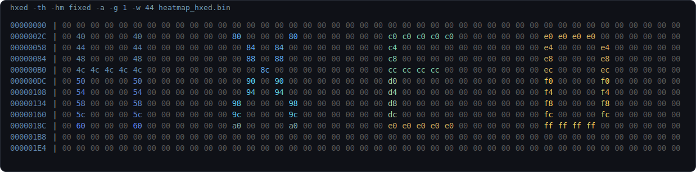
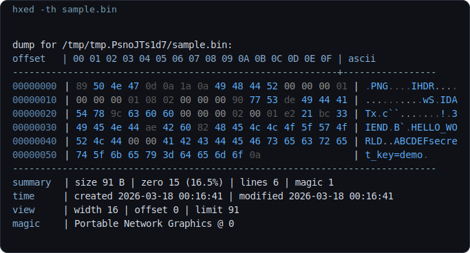
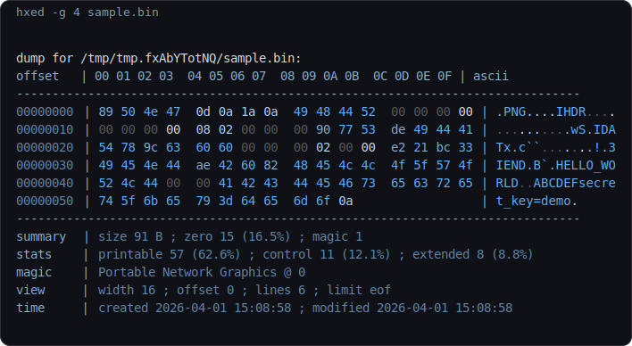
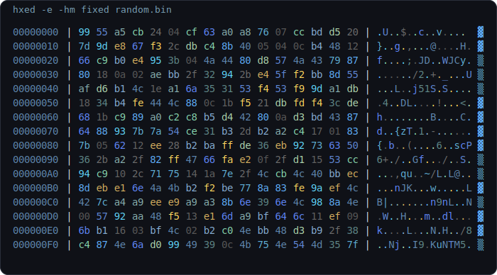
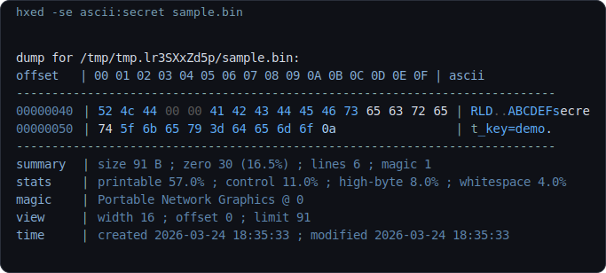
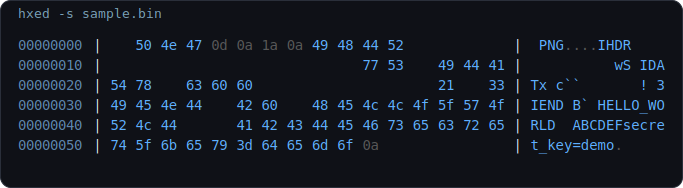
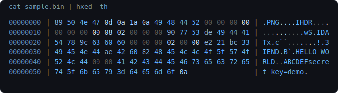

# 📂 hxed — A Modern Cross-Platform Hex Viewer

> A lightweight command-line hex viewer in C with focused colors, heatmaps, entropy, search, string mode, and clean pipe support.

[](https://github.com/jjice/hxed/actions)
[](https://github.com/jjice/hxed/actions)
[](https://github.com/jjice/hxed/actions)
[](https://github.com/jjice/hxed/actions)
[](LICENSE)

---


###### This demo uses a `0x00` background and a handcrafted `HXED` byte pattern so the fixed heatmap shows clear per-letter colors with a top-to-bottom gradient.
---
## Contents

- [Why hxed](#why-hxed)
- [Key Features](#-key-features)
- [Feature Tour](#-feature-tour)
- [Build & Install](#-build--install)
- [Usage](#-usage)
- [Options](#-options)
- [Examples](#-examples)
- [Contributing](#-contributing)
- [License](#-license)

---

## Why hxed

`hexdump` and `xxd` are solid tools. `hxed` is for the moments where a plain dump is technically enough, but still slows you down.

- It makes structure easier to spot at a glance.
- It keeps strings, null bytes, and noisy regions visually distinct.
- It gives you one small tool for normal dumps, focused searches, entropy checks, raw output, and pipe workflows.

If you spend time inspecting binaries, debugging odd files, reversing formats, or comparing unknown blobs, `hxed` is built to make that pass faster and easier on the eyes.

## ✨ Key Features

| | Feature | Description |
|---|---|---|
| 📟 | **Classic Layout** | Perfectly aligned hex bytes, addresses, and ASCII preview |
| 🧩 | **Flexible Grouping** | Group bytes with `-g` for faster pattern scanning in dense dumps |
| 📦 | **Raw Output Mode** | Raw output to a file or to a pipe |
| 🌈 | **Adaptive Heatmaps** | Visualize byte ranges with 16-color `adaptiv` or `fixed` modes |
| 🔍 | **Semantic Coloring** | Instantly distinguish printable text, null bytes, and control characters |
| 🧵 | **String Highlighting** | Specialized mode to make embedded strings pop |
| 📊 | **Entropy Meter** | Real-time Shannon entropy bar per line — spot encryption/compression instantly |
| 🔎 | **Pattern Search** | Match bytes via `-se` in `a:`, `x:`, `d:`, or `b:` format |
| 🏷️ | **Header + Footer Analysis** | Toggle file metadata and magic byte detection with `-th` |
| ⚡ | **Ultra Flexible** | Custom widths, offsets, and limits for surgical binary inspection |
| 🌊 | **Pipe Ready** | Seamless `stdin` support with built-in pager integration (`less`/`more`) |
| 📦 | **Cross-Platform** | Native performance on Linux, macOS, and Windows |

---

## 📸 Feature Tour

Quick jumps:
- [Header + footer analysis](#header--footer-analysis--hxed--th-file)
- [Normal dump](#normal-dump--hxed-file)
- [Grouping view](#grouping-view--hxed--g-4-file)
- [Heatmap gradient](#heatmap-gradient--hxed--hm-fixed-heatmap_gradientbin)
- [Fixed heatmap art](#fixed-heatmap-art--hxed--th--hm-fixed--a--g-1--w-44-heatmap_hxedbin)
- [Entropy view](#entropy-view--hxed--e--hm-fixed-file)
- [ASCII search](#ascii-search--hxed--se-asciisecret-file)
- [String mode](#string-mode--hxed--s-file)
- [Pipe workflow](#pipe-workflow--cat-file--hxed--th)


### Normal dump &nbsp;·&nbsp; `hxed <file>`



Classic layout, readable addresses, colored bytes, and ASCII preview without losing the terminal feel.

### Deactivated Header &nbsp;·&nbsp; `hxed -th <file>`



Header info, footer analysis, and magic-byte detection help you understand a file at a glance instead of manually piecing it together.

### Grouping view &nbsp;·&nbsp; `hxed -g 4 <file>`



Grouping helps separate structured fields quickly when scanning packed binary data.

### Heatmap gradient &nbsp;·&nbsp; `hxed -hm fixed heatmap_gradient.bin`



Fixed heatmap mode gives you a stable 16-step palette across the full byte range, while `adaptiv` remaps the same idea to the actual min/max values in the file.


### Entropy view &nbsp;·&nbsp; `hxed -e -hm fixed <file>`



Useful for spotting compressed, encrypted, or unusually uniform regions quickly.

### ASCII search &nbsp;·&nbsp; `hxed -se a:secret <file>`



Search mode narrows the dump to the relevant lines instead of making you grep around raw hex output.

### String mode &nbsp;·&nbsp; `hxed -s <file>`



Useful when embedded strings, paths, config fragments, or keys matter more than the raw byte values.

### Pipe workflow &nbsp;·&nbsp; `cat <file> | hxed -th`



Pipe-friendly usage keeps it practical in shell workflows where `hexdump` and `xxd` often end up wrapped in extra commands.

---

## 🏗️ Build & Install

### Interactive install scripts

The repository now includes interactive installers that can:

- ask where `hxed` should be installed
- ask before adding that directory to `PATH`
- ask whether to build locally or download the latest GitHub release
- ask whether completions should be installed too

Linux / macOS:

```bash
chmod +x scripts/install.sh
./scripts/install.sh
```

Windows PowerShell:

```powershell
powershell -ExecutionPolicy Bypass -File .\scripts\install.ps1
```

Notes:
- `scripts/install.sh` installs the binary for the current user and can also copy Bash, Zsh, and Fish completions.
- `scripts/install.ps1` installs `hxed.exe`, can add the install directory to the user `PATH`, and can register the PowerShell completion in your PowerShell profile.
- The current GitHub release workflow publishes `hxed-linux-x64`, `hxed-windows-x64.exe`, and `hxed-macos-arm64`. On unsupported architectures, the installer falls back to building from source.

### Manual build

**Requirements:** a C compiler (`gcc` or `clang`) and `CMake`.

```bash
# Quick build via Makefile
make

# Or manually with CMake
cmake -S . -B build
cmake --build build
```

### Optional: install system-wide

```bash
cmake --install build
```

> **Windows tip:** Add `*/build/bin` to your `PATH` environment variable to use `hxed` from any terminal.

### Manual completion install

If you prefer manual setup, the completion files live in [`completions/`](./completions):

```bash
# Bash
mkdir -p ~/.local/share/bash-completion/completions
cp completions/hxed.bash ~/.local/share/bash-completion/completions/hxed

# Zsh
mkdir -p ~/.zsh/completions
cp completions/_hxed ~/.zsh/completions/_hxed
# add once to ~/.zshrc
fpath=(~/.zsh/completions $fpath)
autoload -Uz compinit && compinit

# Fish
mkdir -p ~/.config/fish/completions
cp completions/hxed.fish ~/.config/fish/completions/hxed.fish
```

PowerShell:

```powershell
. "$PWD\completions\hxed.ps1"
```

### Uninstall

```bash
# Linux / macOS
sudo xargs rm < build/install_manifest.txt

# Windows (PowerShell)
Get-Content build\install_manifest.txt | Remove-Item
```

---

## 🕹️ Usage

```bash
hxed [options] [filename]
cat file.bin | hxed [options]
```

---

## ⚙️ Options

| Option | Description | Default |
|--------|-------------|---------|
| `-f, --file <filename>` | Input file (optional when using stdin) | — |
| `-m, --mode <hex\|bin\|oct\|dec>` | Output mode | `hex` |
| `-hm, --heatmap <adaptiv\|fixed>` | Heatmap mode with 16 colors | none |
| `-w, --width <num>` | Bytes per line (`0` = no newline) | `16` |
| `-g, --grouping <num>` | Group bytes visually (`0` = no spaces) | `1` |
| `-a, --ascii` | Toggle ASCII column | on |
| `-th, --toggle-header` | Deactivate header, footer and magic byte detection | on |
| `-o, --offset <num>` | Start reading at this byte offset | `0` |
| `-r, --read-size <num>` | Stop reading after this many bytes | `0` |
| `-l, --limit <num\|hex>` | Stop at this byte address | EOF |
| `-c, --color` | Toggle syntax coloring | on |
| `-s, --string` | Toggle string highlighting | off |
| `-p, --pager` | Toggle pager output through `less`/`more` | off |
| `-e, --entropy` | Toggle Shannon entropy bar per line | off |
| `-sz, --skip-zero` | Skip all-zero lines | off |
| `-se, --search <pattern>` | Search `a:`, `x:`, `d:`, or `b:` patterns | — |
| `-ro, --raw` | Raw output (no ANSI, for piping to files), use `-w 0` for no newlines| — |
| `-v, --version` | Show version and exit | — |
| `-h, --help` | Show help and exit | — |

**Notes:**
- Toggle flags flip the current default state.
- `-a` disables ASCII because ASCII is on by default.
- `-c` disables colors because color is on by default.
- `-th` disables the header/footer block because it is on by default.
- `-se` highlights the matched bytes and only prints matching lines.
- `--limit` must not be less than `--offset`.
- Magic byte detection is disabled when `--offset` is set.
- Search currently works for files, not for `stdin`.
- When reading from stdin, a filename is not required.
- If stdin and a filename is given, stdin is ignored.

---

## 🔎 Examples

```bash
# Basic hex dump
hxed example.txt

# Smaller width
hxed -w 8 example.txt

# Group bytes in blocks of 4
hxed -g 4 firmware.bin

# 32 bytes/line, toggle ASCII column off
hxed -w 32 -a secret.bin

# Render in decimal mode
hxed -m dec -g 8 sample.bin

# Adaptive heatmap on a binary
hxed -hm adaptiv image.png

# Fixed heatmap, toggle ASCII off
hxed -hm fixed -a sample.bin

# Skip zero-only lines
hxed -sz firmware.bin

# Inspect a slice of a file (bytes 1024–2048)
hxed -o 1k -l 2k sample.bin

# String highlighting
hxed -s image.png

# Search for an ASCII pattern
hxed -se 'a:ABC' sample.bin

# Search for a hex pattern
hxed -se 'x:FF D8 FF' photo.jpg

# Search for decimal bytes
hxed -se 'd:72,101,108,108,111' sample.bin

# Search for binary bytes
hxed -se 'b:01001000,01101001' sample.bin

# Raw output into a file (no newlines, no ANSI)
hxed -w 0 -ro binary > output.txt

# Pipe from stdin
cat sample.bin | hxed -w 32
echo 'Hello World' | hxed

# Toggle colors off, then pipe to less
hxed -c file | less -R
```

---


---

## 🤝 Contributing
hxed is open-source and contributions are always welcome!

- **Found a bug? 🐛** — Open an [Issue](https://github.com/jjice/hxed/issues)
- **Have an idea? 💡** — Start a thread in [Discussions](https://github.com/jjice/hxed/discussions)
- **Want to contribute code? 💻** — PRs are welcome! Whether it's a performance tweak, new color theme, or a brand new feature — jump in.

---

## 📄 License

MIT License © 2026 Joshua Jallow — see [LICENSE](LICENSE) for details.

---

<div align="center">
  <sub><i>"In binary we trust, in hex we dump." — hxed</i></sub>
</div>
